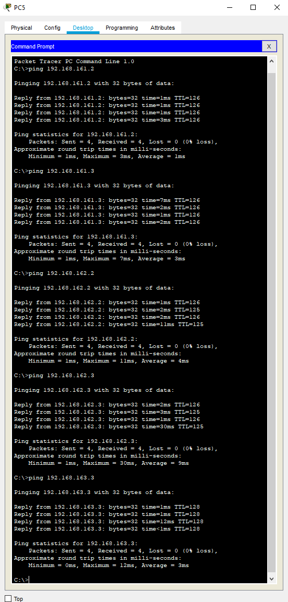

# Practica 2

#### Christopher Alexander Acajabon Gudiel - 201404278
#### Redes de computadoras 1

## Topologia

## Configuracion

### Asignacion de IP'S:

* X = 1 + ( 7 + 8 ) = 16
* IP's para cada maquina:

| Maquina | Direccion IP    | Gateway        |
| ------- | --------------- | --------------- |
| PC1     | 192.168.161.2   | 192.168.161.1  |
| PC2     | 192.168.161.3   | 192.168.161.1  |
| PC3     | 192.168.162.2   | 192.168.162.1  |
| PC4     | 192.168.162.3   | 192.168.162.1  |
| PC5     | 192.168.163.2   | 192.168.163.1  |
| PC6     | 192.168.163.3   | 192.168.163.1  |

* Click en la maquina:
    * Desktop
    * IP Configuration
    * Static:
        * IPv4 Address: IP que corresponde
        * Subnet Mask: por defecto.
        * Default Gateway: Gateway que corresponde.

 ### Asignacion de Gateway en Router (Interfaz Fa0/0)

* Click sobre cada Router:
    * Config
    * FastEthernet0/0
    * Configuracion para: 
        * **R2**:
            * Click sobre la opcion "ON" (parte superior derecha) para encender interfaz.
            * Ipv4 Address: 192.168.161.1
            * Subnet Mask: 255.255.255.0
        * **R1**:
            * Click sobre la opcion "ON" (parte superior derecha) para encender interfaz.
            * Ipv4 Address: 192.168.162.1
            * Subnet Mask: 255.255.255.0
        * **R3**:
            * Click sobre la opcion "ON" (parte superior derecha) para encender interfaz.
            * Ipv4 Adress: 192.168.163.1
            * Subnet Mask: 255.255.255.0

### Configuracion Serial

* X = 1 + ( 7 + 8 ) = 16

| Conexión | Dirección de Red | Primera Dirección Asignable | Gateway |
| -------- | ----------------- | ---------------------------- | ------- |
| R1-R2    | 172.161.0.0/16    | 172.161.0.1                   | N.A.    |
| R1-R3    | 172.162.0.0/16    | 172.162.0.1                   | N.A.    |
| R2-R3    | 172.163.0.0/16    | 172.163.0.1                   | N.A.    |

* Configuracionr:
    * **R2**:
        * Click en router -> Config -> Serial2/0
            * Click sobre la opcion "ON" (parte superior derecha) para encender interfaz.
            * Ipv4 Address: 172.161.0.2
            * Subnet Mask: 255.255.0.0
        * Click en router -> Config -> Serial3/0
            * Click sobre la opcion "ON" (parte superior derecha) para encender interfaz.
            * Ipv4 Address: 172.163.0.2
            * Subnet Mask: 255.255.0.0
    * **R1**:
        * Click en router -> Config -> Serial2/0
            * Click sobre la opcion "ON" (parte superior derecha) para encender interfaz.
            * Ipv4 Address: 172.161.0.3
            * Subnet Mask: 255.255.0.0
        * Click en router -> Config -> Serial3/0
            * Click sobre la opcion "ON" (parte superior derecha) para encender interfaz.
            * Ipv4 Address: 172.162.0.2
            * Subnet Mask: 255.255.0.0
    * **R3**:
        * Click en router -> Config -> Serial2/0
            * Click sobre la opcion "ON" (parte superior derecha) para encender interfaz.
            * Ipv4 Address: 172.163.0.3
            * Subnet Mask: 255.255.0.0
        * Click en router -> Config -> Serial3/0
            * Click sobre la opcion "ON" (parte superior derecha) para encender interfaz.
            * Ipv4 Address: 172.162.0.3
            * Subnet Mask: 255.255.0.0

### Configuracion de Ruteo estatico

* **R2**:
    * Router -> Config -> Router -> Static
    * Ingresar la siguiente configuracion (para agregarlas click en Add):
        * primera:
            * Network: 192.168.162.0
            * Mask: 255.255.255.0
            * Next Hop: 172.161.0.0
        * segunda:
            * Network: 192.168.163.0
            * Mask: 255.255.255.0
            * Next Hop: 172.163.0.0
        * tercera:
            * Network: 192.168.162.0
            * Mask: 255.255.255.0
            * Next Hop: 172.163.0.0
* **R1**:
    * Router -> Config -> Router -> Static
    * Ingresar la siguiente configuracion (para agregarlas click en Add):
        * primera:
            * Network: 192.168.161.0
            * Mask: 255.255.255.0
            * Next Hop: 172.161.0.0
        * segunda:
            * Network: 192.168.163.0
            * Mask: 255.255.255.0
            * Next Hop: 172.162.0.0
        * tercera:
            * Network: 192.168.163.0
            * Mask: 255.255.255.0
            * Next Hop: 172.161.0.0
* **R3**:
    * Router -> Config -> Router -> Static
    * Ingresar la siguiente configuracion (para agregarlas click en Add):
        * primera:
            * Network: 192.168.161.0
            * Mask: 255.255.255.0
            * Next Hop: 172.163.0.0
        * segunda:
            * Network: 192.168.162.0
            * Mask: 255.255.255.0
            * Next Hop: 172.162.0.0
        * tercera:
            * Network: 192.168.162.0
            * Mask: 255.255.255.0
            * Next Hop: 172.163.0.0

## Ping

* Ping desde PC1:

* Ping desde PC2:

* Ping desde PC3:

* Ping desde PC4:

* Ping desde PC5:

* Ping desde PC6:

